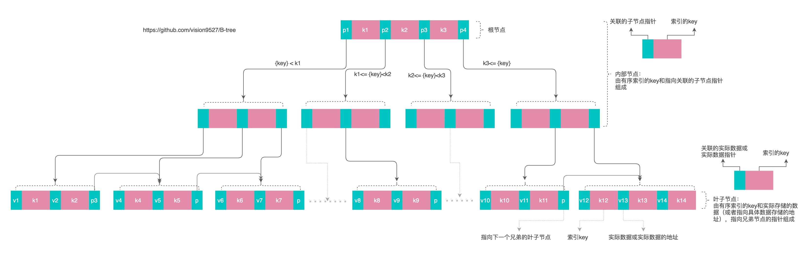

# B+树理论与实现
#### 1、B+树特点

1. 平衡多叉树，从根节点到所有叶子节点的高度相同
1. 叶子节点之间通过指针互连，方便遍历叶子节点
#### 2、B+树结构
1. 节点：由**索引key**和**值pointer**组成，每个节点都保存在一个磁盘的block上，一次IO读取一个block
1. 内部节点组成
    * 内部节点的元素为**索引key**和关联的**子节点指针**
    * 根节点是特殊的内部节点，主要体现在子节点数量限制上
1. 叶子节点组成
    * 叶子节点的元素为**索引key**和**实际数据或指向实际数据的地址**
    * 兄弟叶子节点之间通过指针互连
1. 左子树总是比右子树小，每个节点内部的索引key都是有序排列




#### 3、节点大小
1. 如何计算key的数量？
    * 内部节点：假设，n个索引，n+1指针，block大小4096B，一个指针4B，一个索引4B
        * 4\*n+4\*(n+1) = 4096
        * n = 512
    * 叶子节点：假设，n个索引，n+1指针，block大小4096B，一个数据64B，一个索引4B
        * 64\*n+4\*(n+1) = 4096
        * n = 60
1. 最大、最小节点的数量
    * 根节点含子节点的个数：2<= node ptrs <= n+1
    * 内部节点包含子节点的个数：(n+1)/2 < node ptrs <= n+1
    * 叶子节点包含数据的个数：n/2 < record ptrs(keys) <= n

1. 一般3层高度的B+树即可保存千万级别的数据，如何计算一颗B+树能保存的数据量？
    * 根据以上的计算数据可推出，512 * 512 * 60 = 15728640
    * 约保存1千万左右数据

#### 4、查询
伪代码
```
    search(x) value
        {
            /* ---------------------------------------------------------
                search next node until leaf node 
                let:
                    node is current node
                    internal node = keys + ptrs
                    internal node : |p1|k1|p2|k2|....|pn|kn|next|
                    leaf node = keys + values
                    leaf node : |v1|k1|v2|k2|....|vn|kn|next|
                ---------------------------------------------------------
            */
            node = root
            for {
                if node != leaf node {
                    find_flag := false
                    for i := 0; i < len(keys)-1;i++ {
                        if x < keys[i] {
                            node = ptrs[i]
                            find_flag = true
                            break
                        }

                    }
                    if !find_flag {
                        node = next
                    }
                } else {
                    for i, key := range keys {
                        if x == key {
                            return values[i]
                        }
                    }
                    return nil
                }
            }
        }
```

#### 5、插入
伪代码
```
insert(x, v) {
    search node
    L = leaf node need to be insert
    if L != full {
        insert_to_leaf(x, v, N) to L
    } else {
        make a virtual node T can hold N and (x, v) by copy of L in memory
        insert_to_leaf(x, v, T) to virtual node
        m = middle key in L ([n+1]/2)
        R = new node()
        copy the left of virtual node T to L according to m
        copy the right of virtual node T to L according to m
        R link to L.next
        L.next link to R
        if L is root {
            make a new root containing (L, m, R)
        } else {
            insertInternal(m, Pr, L.parent)
    }   
}

insert_to_leaf(x, v, N) {
    Let Ki is the smallest value in N that is great than x
    insert(x, v) to N before N.Ki
}

insertInternal(m, Pr, N) {
    if N != full {
        insert_to_internal(m, Pr, N) to N
    } else {
        make a virtual node T can hold N and (m, Pr) by copy of N in memory
        insert_to_internal(m, Pr, T) to virtual node
        m = middle key in N ([n+1]/2)
        erase all entries in N
        R = new node()
        copy the left of virtual node T to N according to m
        copy the right of virtual node T to R according to m
        if L is root {
            make a new root containint (N, m, R)
        } else {
            insertInternal(m, R, N.parent)
        }
    }
}

insert_to_internal(m, Pr, N) {
    Let Ki is the smallest value in N that is great than x
    insert(m, Pr) to N before N.Ki
}

```

#### 6、删除
#### 7. mysql选择B+树而不是B树原因
1. B+树查询在范围查询效率更高，B+树在范围查询可以根据叶子节点的链接直接顺序遍历，B树需要遍历完子树才能完成范围查找，访问的磁盘IO次数更多
1. B+树查询效率更稳定，B+树每次访问数据都会到达叶子节点，查询时间稳定，而B树访问的数据不确定在第几层所以查询效率不太稳定