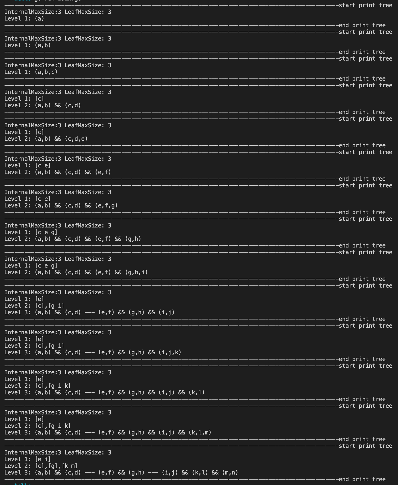
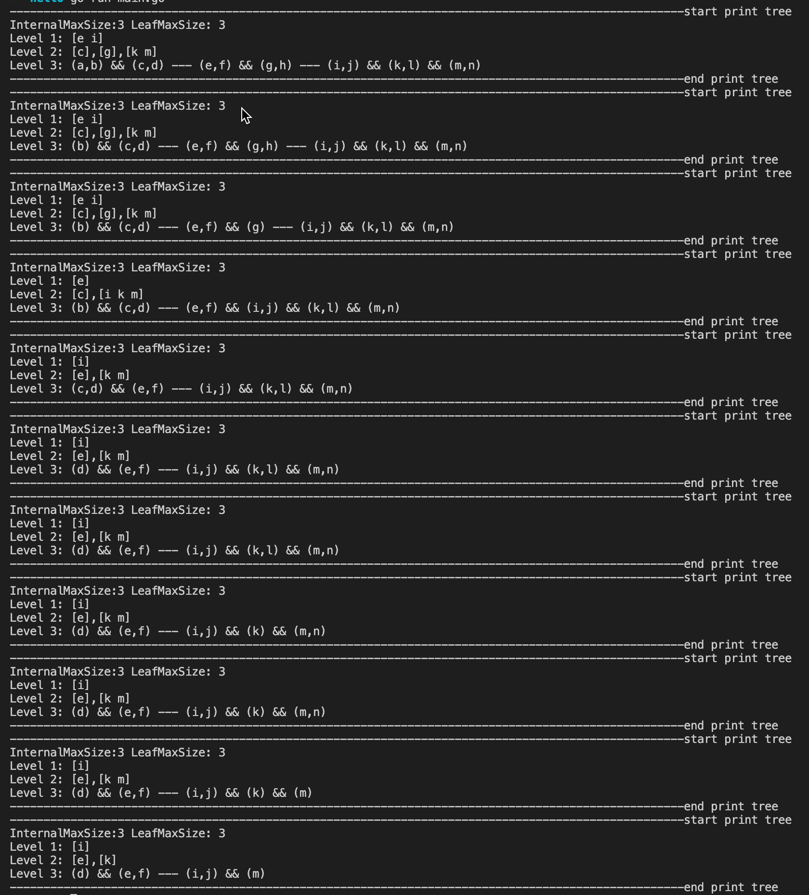

## Go implementation of B+ tree

This is a pure go implementation of B plus tree in memory. It's a toy project and not recommended to be used in production environment. The algorithm is from the chapter 14 of Database System Concepts 7th Edition.

You can submit issues if you have any questions.

Welcome to submit mr too.

## Getting Started
### Installing
```$ go get github.com/vision9527/btree```

### Using
```go
package main

import (
	"fmt"

	"github.com/vision9527/btree"
)

func main() {
	tree, _ := btree.StartDefaultNewTree()
	k := "a"
	v := "ack"
	tree.Insert(k, v)
	value, ok := tree.Find(k)
	fmt.Println("value: ", value, ok)
	tree.Insert("b", "bson")
	tree.Insert("c", "canal")
	tree.Insert("d", "django")
	values := tree.FindRange("a", "c")
	fmt.Println("values: ", values)
}
```

### Viewing the process of insert
```go
package main

import (
	"github.com/vision9527/btree"
)

func main() {
	tree, _ := btree.StartNewTree(3, 3)
	tree.Insert("a", "a")
	fmt.Printf("insert %s ...\n", "a")
	tree.Print()
	tree.Insert("b", "b")
	fmt.Printf("insert %s ...\n", "b")
	tree.Print()
	tree.Insert("c", "c")
	fmt.Printf("insert %s ...\n", "c")
	tree.Print()
	tree.Insert("d", "d")
	fmt.Printf("insert %s ...\n", "d")
	tree.Print()
	tree.Insert("e", "e")
	fmt.Printf("insert %s ...\n", "e")
	tree.Print()
	tree.Insert("f", "f")
	fmt.Printf("insert %s ...\n", "f")
	tree.Print()
	tree.Insert("g", "g")
	fmt.Printf("insert %s ...\n", "g")
	tree.Print()
	tree.Insert("h", "h")
	fmt.Printf("insert %s ...\n", "h")
	tree.Print()
	tree.Insert("i", "i")
	fmt.Printf("insert %s ...\n", "i")
	tree.Print()
	tree.Insert("j", "j")
	fmt.Printf("insert %s ...\n", "j")
	tree.Print()
	tree.Insert("k", "k")
	fmt.Printf("insert %s ...\n", "k")
	tree.Print()
	tree.Insert("l", "l")
	fmt.Printf("insert %s ...\n", "l")
	tree.Print()
	tree.Insert("m", "m")
	fmt.Printf("insert %s ...\n", "m")
	tree.Print()
	tree.Insert("n", "n")
	fmt.Printf("insert %s ...\n", "n")
	tree.Print()
}

```


### Viewing the process of delete
```go
package main

import (
	"github.com/vision9527/btree"
)

func main() {
	tree, _ := btree.StartNewTree(3, 3)
	tree.Insert("a", "a")
	tree.Insert("b", "b")
	tree.Insert("c", "c")
	tree.Insert("d", "d")
	tree.Insert("e", "e")
	tree.Insert("f", "f")
	tree.Insert("g", "g")
	tree.Insert("h", "h")
	tree.Insert("i", "i")
	tree.Print()
	tree.Delete("a")
	fmt.Printf("delete %s ...\n", "a")
	tree.Print()
	tree.Delete("h")
	fmt.Printf("delete %s ...\n", "h")
	tree.Print()
	tree.Delete("g")
	fmt.Printf("delete %s ...\n", "g")
	tree.Print()
	tree.Delete("b")
	fmt.Printf("delete %s ...\n", "b")
	tree.Print()
	tree.Delete("c")
	fmt.Printf("delete %s ...\n", "c")
	tree.Print()
	tree.Delete("a")
	fmt.Printf("delete %s again ...\n", "a")
	tree.Print()
	tree.Delete("i")
	fmt.Printf("delete %s ...\n", "i")
	tree.Print()
	tree.Delete("f")
	fmt.Printf("delete %s ...\n", "f")
	tree.Print()
	tree.Delete("d")
	fmt.Printf("delete %s ...\n", "d")
	tree.Print()
	tree.Delete("e")
	fmt.Printf("delete %s ...\n", "e")
	tree.Print()
}
```
